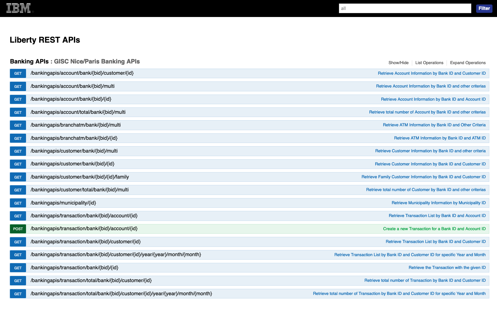
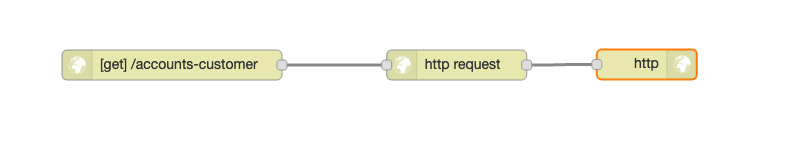
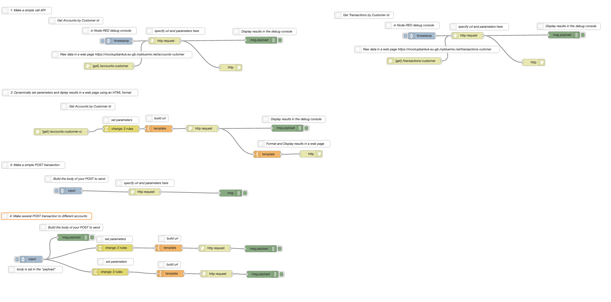
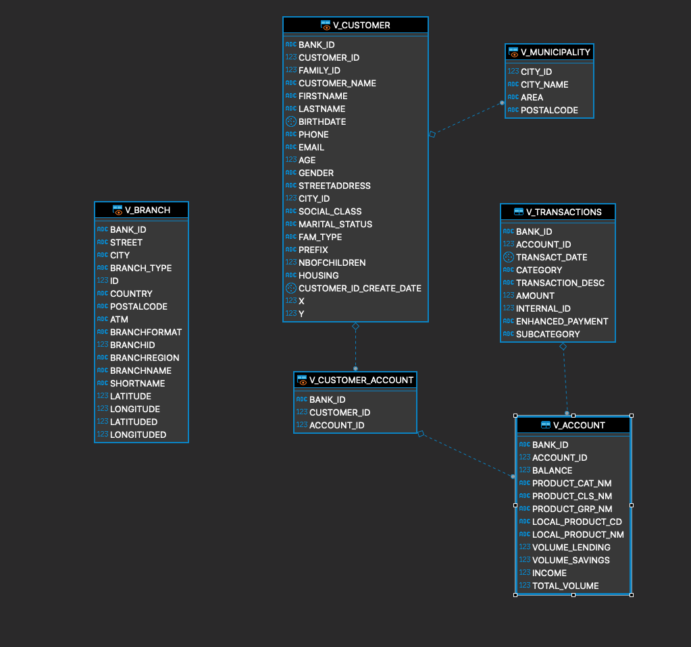
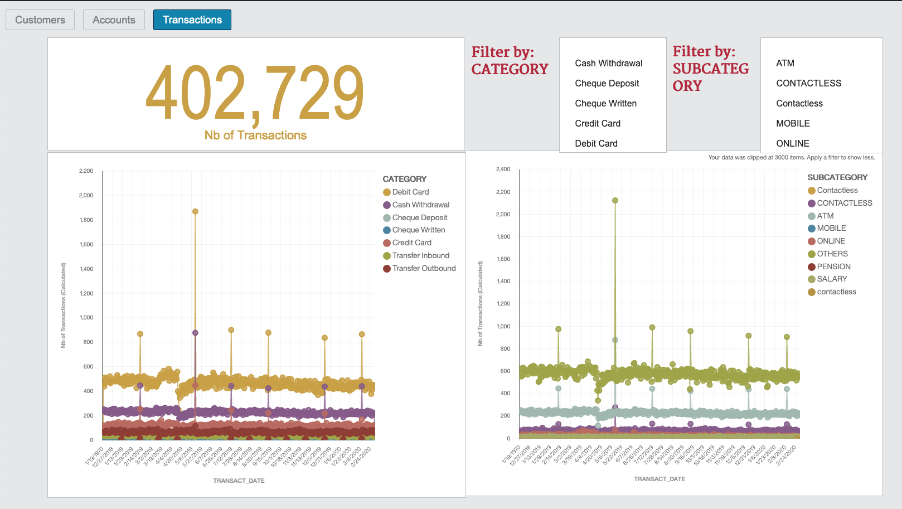

# IBM Mockup Bank developer toolkit

All you need to know about the fictious **Banking Data Model &amp; APIs** for the Hackathon.

This page will provide high level documentation, the basics and links to get to the **APIs** and more detailed documentation.
+ Detailed documentation of the **IBM Mockup bank APIs** is [here](assets/mockupbank-api-doc.md)
+ Access to a Node-RED application as an example on how to consume the APIs (You only have access as a viewer to get inspiration and build your own Node-RED application.)
+ Detailed documentation of the Data Model is [here](datamodel/DataModel.md)

---

### Starting with APIs

The IBM Mockup Bank exposes REST APIs in order to let developers access mock banking data and use it in their applications (web app, mobile app..)

> **Note:** REST is an acronym for Representational State Transfer — an almost meaningless description of the most-used web service technology! REST is a way for two computer systems to communicate over HTTP in a similar way to web browsers and servers.

> **Note:** An application programming interface (API) is an interface or communication protocol between different parts of a computer program intended to simplify the implementation and maintenance of software. An API may be for a web-based system, operating system, database system, computer hardware, or software library.

So if you are a developing a Node.js application for example you may want to collect information about Customers in your application to make some analysis.
You will use then the following API available in the Mockup Bank APIs to retrieve all your customer in your Bank (knowing there is only one Bank bid=1 in the Mockup Bank today)

```
get /bankingapis/customer/bank/{bid}/multi
```
You will need specific node libraries to make your API call. This is dependant of your programming language. There are usually several methods to do it (https://levelup.gitconnected.com/all-possible-ways-of-making-an-api-call-in-plain-javascript-c0dee3c11b8b)
From the Mockup Bank side, you will need the right path and the right parameters as detailed in the doc.

If you are not very comfortable with any programming language, one possibility for you to create an application consuming APIs easily would be to use Node-RED (Look at the Node-RED section)


---

### The API Swagger  

The **API swagger** for the Mockbank is available here: https://mockupbank-da.bnk-kno.nca.ihost.com/api/explorer/#/


> **Note:** the above URL is the swagger which will allow you to test the APIs and the domain for all the APIs for the *MockupBank application*.

All Mockup Bank APIs available are listed here.

This lets developers explore the APIs that are available, the required and optional parameters, and schema for responses.




---
### A Node-RED application  
Node-RED is an open source programming tool for wiring together hardware devices, APIs and online services in new and interesting ways.

It provides a browser-based editor that makes it easy to wire together flows using the wide range of nodes in the palette that can be deployed to its runtime in a single-click.

Everything you need to know about how to develop applications with Node-RED is available at: https://nodered.org/
You can find, open source Node-RED flows, nodes libraries, documentation...

For example, making a call API with Node-RED and display it in a web page will look like that:



With Node-RED, you could for example create your web application to visualise data from the Mockup Bank.

As an example of usage of the APIs, a sample Web Application has been built as an example of rapidly prototyping an app.

We have built in the first tab examples of simple operations to execute with Node-RED and the APIs:



We also have built a more advanced piece of code which create a web  UI available at the following URL:


The Node-RED application code (read only) is available here:

---
### The Data model  

The **Data Model** is a simplistic one based on Customers, Accounts and Transactions.

The provided data is based on the following schema which is an extract of a larger data model.


More details about the data model and its entities is available [here](datamodel/DataModel.md)

---
### The Data Dynamic Dashboard  

A dynamic dashboard is available as a mean of descriptive analytic [here](https://eu-gb.dataplatform.cloud.ibm.com/dashboards/c30b0802-4968-4b88-a71f-d2f1b60e86ae/view/7c35c90104a018965ff6c0e4079f24527f36715db1bb8a0380877b4959632497a96d1691c87a490c89120264fbed445a9b)


The dashboard is composed of three tabs:
- Customers
- Accounts
- Transactions

It displays **counts** and **charts** which can be filtered by various means.



All the widgets on the dashboard are connected which means that selection on one widget will filter content of other widgets.

Please note that this dashboard **DOES NOT** consume the exposed APIs but queries directly against the database.
