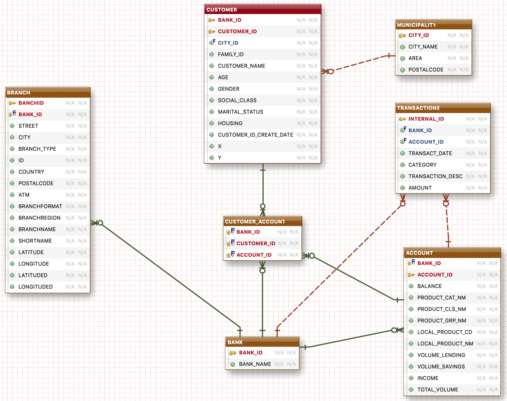
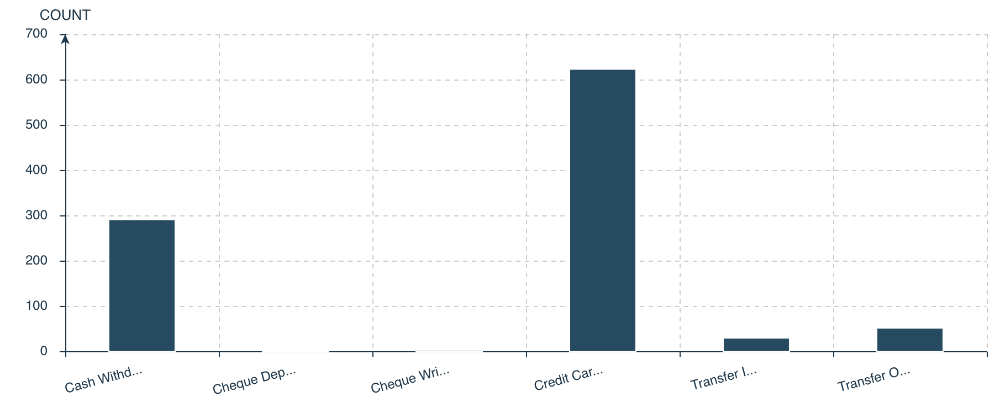
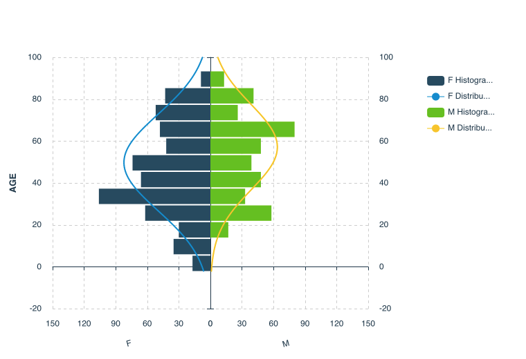
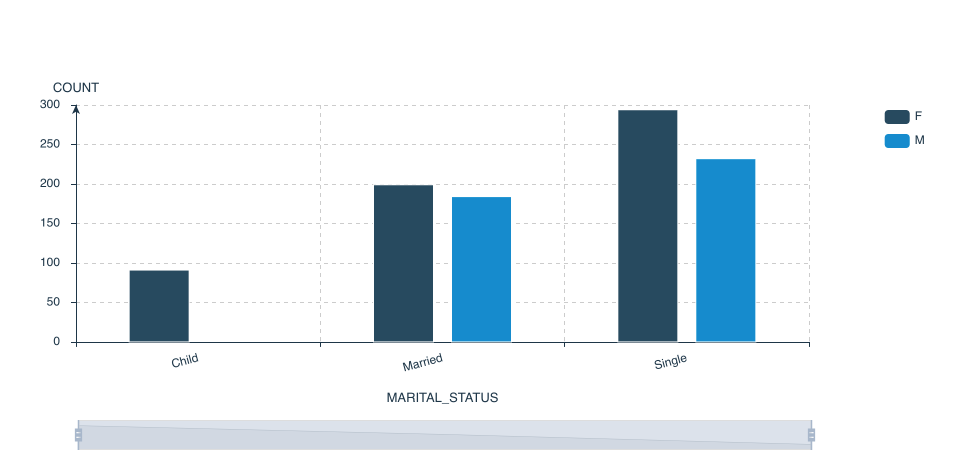
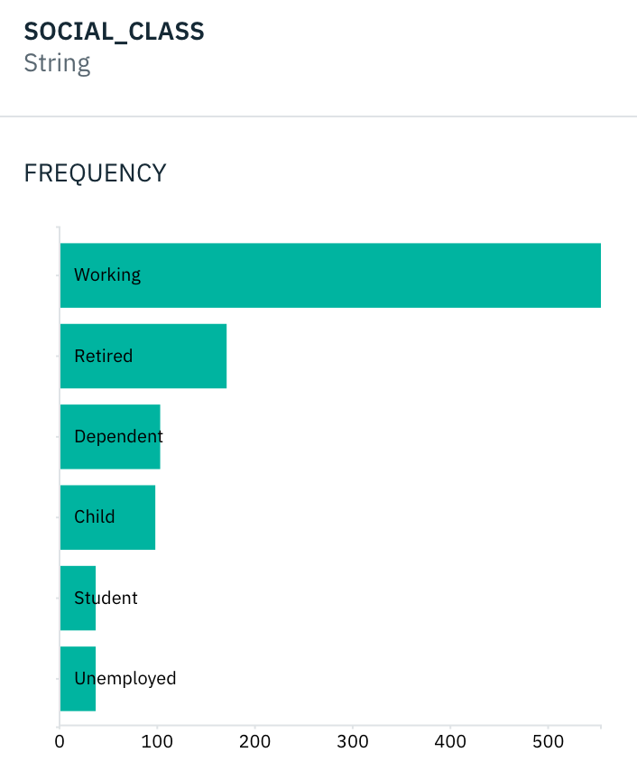
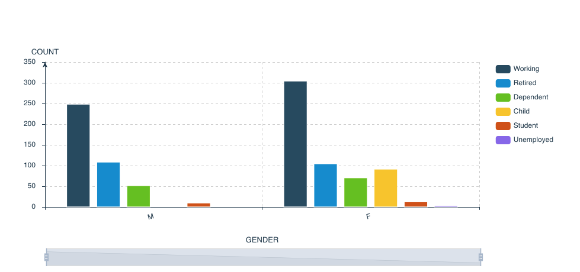
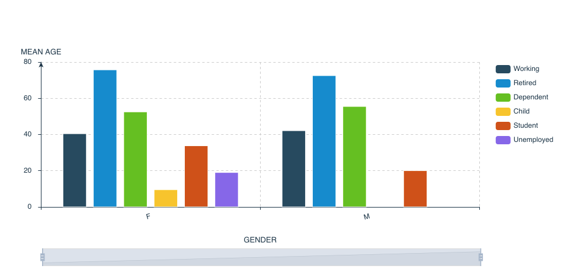

# Fictious Bank Data model

## Data model

The following data model is a subset of a larger data model and contains the entities exposed via the **REST APIs** documented [here](../mockup-api-doc.png)

This page will explain what each entities are and how they are related to one another.

## Bank entity
This entity represents a Bank as for example the different brands for **RBS**:
+ NatWest
+ Ulster Bank
+ Isle of Man Bank
+ RBS International
+ ...
As we only manage a single bank for the duration of the Hackathon, there will be a single `BANK_ID` value available which is `1`.

> **Note:** `Bank_ID` is used for all the APIs. It's referenced as `{bid}` is the API documentation. For the duration of the Hackathon replace {bid} by `1`.

## Customer_Account
This entity manages the *many to many* relationship between **Customer** and **Account** meaning:
+ A customer can have 0 to many accounts in the bank.
+ An account could be hold by one or many customers. For example a shared account for a married couple.
This entity is not exposed with an API, however it is obviously used to retrieve accounts for customers.

## Account
This entity is a bank account owned by one or several customers. Accounts are of different types:
+ Current
+ Savings
+ Personal Loan
+ Mortgage
+ Investment
+ Insurance Life
+ Insurance Damage

Accounts are uniquely identified by their `ACCOUNT_ID` which ranges from 1 to 10017.
Accounts have a `BALANCE` and a `VOLUME_LENDING` *(for Loan and Mortgage accounts)*.

## Transaction
Transactions are all the inbound and outbound money movement from an account to another account or to the account from another account. Accounts can be accounts within the Bank or third parties.

Transaction types:
+ Cash Withdrawal  
+ Cheque Deposit
+ Cheque Written
+ Credit Card
+ Transfer Inbound
+ Transfer Outbound

A large part of the transactions are `Credit Card` and `Cash Withdrawal` categories.

> **Note:** in the API documentation there is a notice about the `POST` API for the transactions. Note that when you initiate a transaction it is reflected on the related account.

## Customer
Customers are generated randomly based on a series of distribution rules which are representatives of the United Kingdom. Among the distribution rules are:
+ Gender Distribution
+ Age Distribution
+ Geographic distribution
Distribution which are not UK specific are the marital status, social class and employment status which are more generic distribution rules based on observations of western countries and USA, thus pretty close to what might be expected in United Kingdom.
> **Note**: bias or deviation from the distribution rules might be observed depending on the volume of data generated. Obviously, the more data, the closer we get to the distribution rules.

Customers are uniquely identified by their `CUSTOMER_ID` which ranges from 2 to 2802.

### Marital status
Possible values are:
+ Married
+ Single
+ Divorced
+ Child

### Family_ID
Family_ID is a field that allows to regroup customers (persons) that are part of the same family, like husband and spouse and children.

### Social Class
Possible values are:
+ working
+ Retired
+ Student
+ Unemployed
+ Child

### Housing
Tells whether a customer owns the house he lives in or not. Possible values are:
+ Owner
+ Tennant
+ Spouse
+ Child

### Descriptive Analysis for Customers
**Age Distribution**
by gender

by Marital status

**Social Class Distribution**

**Gender and Social Class Distribution**

**by age mean**

## Branches
Branches are Bank's presence over the country, be it a simple ATM, a Community Bank Office or a Central Bank Office. Branches are uniquely identified by their `Branch_Id` which values range from 1 to 1801. All branches are considered to have at least one ATM (boolean attribute ATM) and are localised by their coordinates: `LATITUDED` and `LONGITUDED`.
All the other attributes are descriptive information mostly related to the geo localisation of the branch( street, region, ...).

### Branch Type
+ ATM
+ Community
+ Central

## Municipality
Municipality is the entity used to geolocalise `Customers` and `Branches`. Municipalities are considered to be cities. The geographic hierarchy is basic and doesn't reflect how United Kingdom cities, counties, areas and region are organised.
We have 32 provinces and 92 cities: *(only provinces are listed here)*
+ Bedfordshire
+ Berkshire
+ Bristol
+ Cambridgeshire
+ Derbyshire
+ Devon
+ Dorset
+ East Riding of Yorkshire
+ East Sussex
+ Essex
+ Gloucestershire
+ Greater London
+ Greater Manchester
+ Hampshire
+ Hertfordshire
+ Lancashire
+ Leicestershire
+ Merseyside
+ Norfolk
+ North Yorkshire
+ Northamptonshire
+ Nottinghamshire
+ Oxfordshire
+ South Yorkshire
+ Staffordshire
+ Suffolk
+ Surrey
+ Tyne and Wear
+ West Midlands
+ West Sussex
+ West Yorkshire
+ Wiltshire
+ Yorkshire

Population distribution is reflected fro the cities according to 2014 UK census on the largest top 100 cities in the Kingdom.
