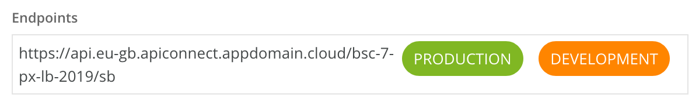

# IBM API Connect APIs documentation
 This guide is your introduction to quickly get started leveraging **IBM Cloud** and the **Banking APIs** to create new solutions. This document describes the APIs available.


**Base URL:** https://api.eu-gb.apiconnect.appdomain.cloud/bsc-7-px-lb-2019/sb


**Path:**   /bankingapis/

**API version:** reboot-mockup-bank-apiconnect (1.0.0)  


---
## API list
<ul>
<li class="tocItem operation toc-apis_reboot-mockup-bank-rest-apis100_paths_bankingapisaccountbankbidcustomerid_get">
<a class="get" onclick="API.navigateop('apis_reboot-mockup-bank-rest-apis100_paths_bankingapisaccountbankbidcustomerid_get', 'apis_reboot-mockup-bank-rest-apis100')" href="javascript:;" title="GET /bankingapis/account/bank/{bid}/customer/{id}">GET /bankingapis/account/bank/{bid}/customer/{id}</a>
</li>
<li class="tocItem operation toc-apis_reboot-mockup-bank-rest-apis100_paths_bankingapisaccountbankbidmulti_get">
  <a class="get" onclick="API.navigateop('apis_reboot-mockup-bank-rest-apis100_paths_bankingapisaccountbankbidmulti_get', 'apis_reboot-mockup-bank-rest-apis100')" href="javascript:;" title="GET /bankingapis/account/bank/{bid}/multi">GET /bankingapis/account/bank/{bid}/multi</a>
</li>
                                                                                                        <li class="tocItem operation toc-apis_reboot-mockup-bank-rest-apis100_paths_bankingapisaccountbankbidid_get">
  <a class="get" onclick="API.navigateop('apis_reboot-mockup-bank-rest-apis100_paths_bankingapisaccountbankbidid_get', 'apis_reboot-mockup-bank-rest-apis100')" href="javascript:;" title="GET /bankingapis/account/bank/{bid}/{id}">GET /bankingapis/account/bank/{bid}/{id}</a>
</li>
                                                                                                        <li class="tocItem operation toc-apis_reboot-mockup-bank-rest-apis100_paths_bankingapisaccounttotalbankbidmulti_get">
  <a class="get" onclick="API.navigateop('apis_reboot-mockup-bank-rest-apis100_paths_bankingapisaccounttotalbankbidmulti_get', 'apis_reboot-mockup-bank-rest-apis100')" href="javascript:;" title="GET /bankingapis/account/total/bank/{bid}/multi">GET /bankingapis/account/total/bank/{bid}/multi</a>
</li>
                                                                                                        <li class="tocItem operation toc-apis_reboot-mockup-bank-rest-apis100_paths_bankingapisbranchatmbankbidmulti_get">
  <a class="get" onclick="API.navigateop('apis_reboot-mockup-bank-rest-apis100_paths_bankingapisbranchatmbankbidmulti_get', 'apis_reboot-mockup-bank-rest-apis100')" href="javascript:;" title="GET /bankingapis/branchatm/bank/{bid}/multi">GET /bankingapis/branchatm/bank/{bid}/multi</a>
</li>
                                                                                                        <li class="tocItem operation toc-apis_reboot-mockup-bank-rest-apis100_paths_bankingapisbranchatmbankbidid_get">
  <a class="get" onclick="API.navigateop('apis_reboot-mockup-bank-rest-apis100_paths_bankingapisbranchatmbankbidid_get', 'apis_reboot-mockup-bank-rest-apis100')" href="javascript:;" title="GET /bankingapis/branchatm/bank/{bid}/{id}">GET /bankingapis/branchatm/bank/{bid}/{id}</a>
</li>
                                                                                                        <li class="tocItem operation toc-apis_reboot-mockup-bank-rest-apis100_paths_bankingapiscustomerbankbidmulti_get">
  <a class="get" onclick="API.navigateop('apis_reboot-mockup-bank-rest-apis100_paths_bankingapiscustomerbankbidmulti_get', 'apis_reboot-mockup-bank-rest-apis100')" href="javascript:;" title="GET /bankingapis/customer/bank/{bid}/multi">GET /bankingapis/customer/bank/{bid}/multi</a>
</li>
                                                                                                        <li class="tocItem operation toc-apis_reboot-mockup-bank-rest-apis100_paths_bankingapiscustomerbankbidid_get">
  <a class="get" onclick="API.navigateop('apis_reboot-mockup-bank-rest-apis100_paths_bankingapiscustomerbankbidid_get', 'apis_reboot-mockup-bank-rest-apis100')" href="javascript:;" title="GET /bankingapis/customer/bank/{bid}/{id}">GET /bankingapis/customer/bank/{bid}/{id}</a>
</li>
                                                                                                        <li class="tocItem operation toc-apis_reboot-mockup-bank-rest-apis100_paths_bankingapiscustomerbankbididfamily_get">
  <a class="get" onclick="API.navigateop('apis_reboot-mockup-bank-rest-apis100_paths_bankingapiscustomerbankbididfamily_get', 'apis_reboot-mockup-bank-rest-apis100')" href="javascript:;" title="GET /bankingapis/customer/bank/{bid}/{id}/family">GET /bankingapis/customer/bank/{bid}/{id}/family</a>
</li>
                                                                                                        <li class="tocItem operation toc-apis_reboot-mockup-bank-rest-apis100_paths_bankingapiscustomertotalbankbidmulti_get">
  <a class="get" onclick="API.navigateop('apis_reboot-mockup-bank-rest-apis100_paths_bankingapiscustomertotalbankbidmulti_get', 'apis_reboot-mockup-bank-rest-apis100')" href="javascript:;" title="GET /bankingapis/customer/total/bank/{bid}/multi">GET /bankingapis/customer/total/bank/{bid}/multi</a>
</li>
                                                                                                        <li class="tocItem operation toc-apis_reboot-mockup-bank-rest-apis100_paths_bankingapismunicipalityid_get">
  <a class="get" onclick="API.navigateop('apis_reboot-mockup-bank-rest-apis100_paths_bankingapismunicipalityid_get', 'apis_reboot-mockup-bank-rest-apis100')" href="javascript:;" title="GET /bankingapis/municipality/{id}">GET /bankingapis/municipality/{id}</a>
</li>
                                                                                                        <li class="tocItem operation toc-apis_reboot-mockup-bank-rest-apis100_paths_bankingapistransactionbankbidaccountid_get">
  <a class="get" onclick="API.navigateop('apis_reboot-mockup-bank-rest-apis100_paths_bankingapistransactionbankbidaccountid_get', 'apis_reboot-mockup-bank-rest-apis100')" href="javascript:;" title="GET /bankingapis/transaction/bank/{bid}/account/{id}">GET /bankingapis/transaction/bank/{bid}/account/{id}</a>
</li>
                                                        <li class="tocItem operation toc-apis_reboot-mockup-bank-rest-apis100_paths_bankingapistransactionbankbidaccountid_post">
  <a class="post" onclick="API.navigateop('apis_reboot-mockup-bank-rest-apis100_paths_bankingapistransactionbankbidaccountid_post', 'apis_reboot-mockup-bank-rest-apis100')" href="javascript:;" title="POST /bankingapis/transaction/bank/{bid}/account/{id}">POST /bankingapis/transaction/bank/{bid}/account/{id}</a>
</li>
                                                                                                        <li class="tocItem operation toc-apis_reboot-mockup-bank-rest-apis100_paths_bankingapistransactionbankbidcustomerid_get">
  <a class="get" onclick="API.navigateop('apis_reboot-mockup-bank-rest-apis100_paths_bankingapistransactionbankbidcustomerid_get', 'apis_reboot-mockup-bank-rest-apis100')" href="javascript:;" title="GET /bankingapis/transaction/bank/{bid}/customer/{id}">GET /bankingapis/transaction/bank/{bid}/customer/{id}</a>
</li>
                                                                                                        <li class="tocItem operation toc-apis_reboot-mockup-bank-rest-apis100_paths_bankingapistransactionbankbidcustomeridyearyearmonthmonth_get">
  <a class="get" onclick="API.navigateop('apis_reboot-mockup-bank-rest-apis100_paths_bankingapistransactionbankbidcustomeridyearyearmonthmonth_get', 'apis_reboot-mockup-bank-rest-apis100')" href="javascript:;" title="GET /bankingapis/transaction/bank/{bid}/customer/{id}/year/{year}/month/{month}">GET /bankingapis/transaction/bank/{bid}/customer/{id}/year/{year}/month/{month}</a>
</li>
  <li class="tocItem operation toc-apis_reboot-mockup-bank-rest-apis100_paths_bankingapistransactionbankbidid_get">
  <a class="get" onclick="API.navigateop('apis_reboot-mockup-bank-rest-apis100_paths_bankingapistransactionbankbidid_get', 'apis_reboot-mockup-bank-rest-apis100')" href="javascript:;" title="GET /bankingapis/transaction/bank/{bid}/{id}">GET /bankingapis/transaction/bank/{bid}/{id}</a>
</li>
                                                                <li class="tocItem operation toc-apis_reboot-mockup-bank-rest-apis100_paths_bankingapistransactiontotalbankbidcustomerid_get">
  <a class="get" onclick="API.navigateop('apis_reboot-mockup-bank-rest-apis100_paths_bankingapistransactiontotalbankbidcustomerid_get', 'apis_reboot-mockup-bank-rest-apis100')" href="javascript:;" title="GET /bankingapis/transaction/total/bank/{bid}/customer/{id}">GET /bankingapis/transaction/total/bank/{bid}/customer/{id}</a>
</li>
                                                                <li class="tocItem operation toc-apis_reboot-mockup-bank-rest-apis100_paths_bankingapistransactiontotalbankbidcustomeridyearyearmonthmonth_get">
  <a class="get" onclick="API.navigateop('apis_reboot-mockup-bank-rest-apis100_paths_bankingapistransactiontotalbankbidcustomeridyearyearmonthmonth_get', 'apis_reboot-mockup-bank-rest-apis100')" href="javascript:;" title="GET /bankingapis/transaction/total/bank/{bid}/customer/{id}/year/{year}/month/{month}">GET /bankingapis/transaction/total/bank/{bid}/customer/{id}/year/{year}/month/{month}</a>
</li>                                                      
</ul>

---
## Operations

All `GET` and `POST` operations are grouped under a category. The operations are accessible as REST resources from the **[API Portal](https://sb-bsc-4-or-gisc-lbg.developer.eu.apiconnect.ibmcloud.com)**.


### BANK

Only one bank is available in the rest API. Each API (except municipality) must include the Bank ID `{bid}` parameter to differentiate which bank information you want to access.
**In the current implementation the Bank ID available for 1.**

### CUSTOMER
`Base URL/PATH + “/customer/”`

__Search for customer__

`Base URL/PATH + “/customer/bank/{bid}/multi”`
Retrieves a list of Customers based on search query parameters. The search returns only the 100 first customers matching query parameters order by `customerId` in ascending order. The objective is to use query parameters to limit the returned data,n rather than retrieving the entire list of customers.

__*Sample request: age between 90 and 91.*__


**Response:**  a list of customers with accounts information

```
[
  {
    "id": {
      "customerId": 2886,
      "bankId": 1
    },
    "age": 91,
    "housing": "Owner",
    "customerIdCreateDate": "1982-01-23",
    "customerName": "HEATHER MAXSON",
    "maritalStatus": "Married",
    "famType": "Married, no kids",
    "familyId": 135651,
    "gender": "F",
    "socialClass": "Retired",
    "x": 0,
    "y": 0,
    "municipality": {
      "postalcode": "LO4ND",
      "area": "Greater London",
      "city_id": 75,
      "city_name": "Southwark"
    },
    "accounts": [
      {
        "id": {
          "accountId": 10440,
          "bankId": 1
        },
        "income": 0,
        "localProductCd": "Savings",
        "localProductNm": "Savings",
        "productCatNm": "Savings",
        "productClsNm": "Savings",
        "productGrpNm": "Savings",
        "totalVolume": 0,
        "volumeLending": 0,
        "volumeSavings": 0,
        "balance": 0
      },
      {
        "id": {
          "accountId": 10439,
          "bankId": 1
        },
        "income": 0,
        "localProductCd": "Personal Loan",
        "localProductNm": "Personal Loan",
        "productCatNm": "Personal Loan",
        "productClsNm": "Personal Loan",
        "productGrpNm": "Personal Loan",
        "totalVolume": 0,
        "volumeLending": 0,
        "volumeSavings": 0,
        "balance": 0
      },
     ...
     ...
     ...
    ]
  },   
  {
    "id": {
      "customerId": 2912,
      "bankId": 1
    },
    "age": 91,
    "housing": "Owner",
    "customerIdCreateDate": "2003-09-04",
    "customerName": "DOUGLAS DEVITO",
    "maritalStatus": "Married",
    "famType": "Married family",
    "familyId": 136801,
    "gender": "M",
    "socialClass": "Retired",
    "x": 0,
    "y": 0,
    "municipality": {
      "postalcode": "LO39AT",
      "area": "Greater London",
      "city_id": 32,
      "city_name": "Hackney"
    },
    "accounts": [
      {
        "id": {
          "accountId": 10790,
          "bankId": 1
        },
        "income": 0,
        "localProductCd": "Savings",
        "localProductNm": "Savings",
        "productCatNm": "Savings",
        "productClsNm": "Savings",
        "productGrpNm": "Savings",
        "totalVolume": 0,
        "volumeLending": 0,
        "volumeSavings": 0,
        "balance": 0
      },
      ...
      ...
      ...
    ]
  },
    ...
    ...
    ...
]
```


__Retrieve customer information__

`Base URL/PATH + “/customer/bank/{bid}/{id}”`

Retrieves the details of a customer based on the customer ID. IDs are string (such as '1').

**Response:**  a customer with accounts information
```
{
  "id": {
    "customerId": 1,
    "bankId": 1
  },
  "age": 37,
  "housing": "Child",
  "customerIdCreateDate": "1981-06-26",
  "customerName": "BRADLEY MOORE",
  "maritalStatus": "Child",
  "famType": "Child",
  "familyId": 100,
  "gender": "M",
  "socialClass": "Child",
  "x": 0,
  "y": 0,
  "municipality": {
    "postalcode": "LO25LO",
    "area": "Greater London",
    "city_id": 35,
    "city_name": "Harrow"
  },
  "accounts": [
    {
      "id": {
        "accountId": 1,
        "bankId": 1
      },
      "income": 0,
      "localProductCd": "Savings",
      "localProductNm": "Savings",
      "productCatNm": "Savings",
      "productClsNm": "Savings",
      "productGrpNm": "Savings",
      "totalVolume": 0,
      "volumeLending": 0,
      "volumeSavings": 0,
      "balance": 0
    },
    {
      "id": {
        "accountId": 2,
        "bankId": 1
      },
      "income": 0,
      "localProductCd": "Current",
      "localProductNm": "Current",
      "productCatNm": "Current",
      "productClsNm": "Current",
      "productGrpNm": "Current",
      "totalVolume": 0,
      "volumeLending": 0,
      "volumeSavings": 0,
      "balance": 0
    }
  ]
}
```

__Retrieve family  information__

`Base URL/PATH + “/customer/bank/{bid}/{id}/family”`

Retrieves all the customers that are relatives (part of the same family) of the customer identified by customer ID. IDs are string (such as '7').

**Response:**  a list of customers of the same family with their bank accounts
```
[
  {
    "id": {
      "customerId": 6,
      "bankId": 0
    },
    "age": 93,
    "housing": "Tennant",
    "customerIdCreateDate": "19390705",
    "customerName": "Solo Customer ID",
    "maritalStatus": "Married",
    "famType": "Married family",
    "familyId": 451,
    "gender": "F",
    "socialClass": "Working",
    "x": 0,
    "y": 0,
    "municipality": {
      "postalcode": "LO75ND",
      "area": "Greater London"
      "city_id": 1,
      "city_name": "Barking"
    },
    "accounts": [
      {
        "balance": 0,
        "id": {
          "accountId": 13,
          "bankId": 0
        },
        "income": 0,
        "localProductCd": "Savings",
        "localProductNm": "Savings",
        "productCatNm": "Savings",
        "productClsNm": "Savings",
        "productGrpNm": "Savings",
        "totalVolume": 0,
        "volumeLending": 0,
        "volumeSavings": 0
      }
    ]
  },
  {
    "id": {
      "customerId": 7,
      "bankId": 0
    },
    "age": 93,
    "housing": "Owner",
    "customerIdCreateDate": "19721201",
    "customerName": "Solo Customer ID",
    "maritalStatus": "Married",
    "famType": "Married family",
    "familyId": 451,
    "gender": "F",
    "socialClass": "Retired",
    "x": 0,
    "y": 0,
    "municipality": {
      "postalcode": "LO75ND",
      "area": "Greater London"
      "city_id": 1,
      "city_name": "Barking"
    },
    "accounts": [
      {
        "balance": 0,
        "id": {
          "accountId": 24,
          "bankId": 0
        },
        "income": 0,
        "localProductCd": "Investment",
        "localProductNm": "Investment",
        "productCatNm": "Investment",
        "productClsNm": "Investment",
        "productGrpNm": "Investment",
        "totalVolume": 0,
        "volumeLending": 0,
        "volumeSavings": 0
      }
    ]
  }
]
```
__Retrieve municipality  information__

`Base URL/PATH + “/municipality/{id}”`

Retrieves a location (a city) name based on the municipality ID.
> **Note:** that you do not really need it, as all data containing municipality always contains the municipality name. IDs are string (such as '1').

**Response:**  a municipality
```
{
  "postalcode": "LO75ND",
  "area": "Greater London"
  "city_id": 1,
  "city_name": "Barking"
}
```
## BRANCH
A branch in a Bank physical location. It can be as small as an ATM in the street. Three type of branches:
1. ATMs
2. Central
3. Community

`Base URL/PATH + “/branchatm/”`

__Search for an ATM__

`Base URL/PATH + “/branchtatm/bank/{bid}/{id}”`
Retrieves the Branch/ATM based on its unique ID. IDs are string (such as '1405'). You may prefer to use the /branchatm/multi for a search.

> **Note:** the ATM field in the below response is a boolean indicating whether the returned branch as an ATM or not. We consider all branches have at least one ATM, so this field will always be '1'.  

**Response:**  a branch ATM
```
{
  "id": {
    "id": "1405",
    "bankId": 1
  },
  "atm": "1",
  "branchType": "ATM",
  "branchformat": "ATM",
  "branchid": 1405,
  "branchregion": "Greater London",
  "country": "UK",
  "branchname": "Southwark-MOUNT ROYAL 9-ATM",
  "shortname": "Southwark-ATM1405",
  "postalcode": "",
  "street": "MOUNT ROYAL 9",
  "city": "Southwark",
  "latitude": 51,
  "longitude": 0,
  "latitudeD": 51.517937,
  "longitudeD": -0.081087
}
```

__Search for a list of ATMs__

`Base URL/PATH + “/branchtatm/bank/{bid}/multi”`

Retrieves a list of Branches/ATMs based on search query parameters.

**Possible parameters:** `city="Oxord", branch_region="Oxfordshire"`


**Response:**  a list of branch ATMs
```
[[
  {
    "id": {
      "id": "802",
      "bankId": 1
    },
    "atm": "1",
    "branchType": "ATM",
    "branchformat": "ATM",
    "branchid": 802,
    "branchregion": "Oxfordshire",
    "country": "UK",
    "branchname": "Oxford-BALLYVESTER ROAD 714-ATM",
    "shortname": "Oxford-ATM802",
    "postalcode": "",
    "street": "BALLYVESTER ROAD 714",
    "city": "Oxford",
    "latitude": 51,
    "longitude": -1,
    "latitudeD": 51.752021,
    "longitudeD": -1.257726
  },
  {
    "id": {
      "id": "803",
      "bankId": 1
    },
    "atm": "1",
    "branchType": "ATM",
    "branchformat": "ATM",
    "branchid": 803,
    "branchregion": "Oxfordshire",
    "country": "UK",
    "branchname": "Oxford-BALLYVESTER ROAD 714-ATM",
    "shortname": "Oxford-ATM803",
    "postalcode": "",
    "street": "BALLYVESTER ROAD 714",
    "city": "Oxford",
    "latitude": 51,
    "longitude": -1,
    "latitudeD": 51.752021,
    "longitudeD": -1.257726
  },
  {
    "id": {
      "id": "804",
      "bankId": 1
    },
    "atm": "1",
    "branchType": "ATM",
    "branchformat": "ATM",
    "branchid": 804,
    "branchregion": "Oxfordshire",
    "country": "UK",
    "branchname": "Oxford-BALLYVESTER ROAD 714-ATM",
    "shortname": "Oxford-ATM804",
    "postalcode": "",
    "street": "BALLYVESTER ROAD 714",
    "city": "Oxford",
    "latitude": 51,
    "longitude": -1,
    "latitudeD": 51.752021,
    "longitudeD": -1.257726
  },
  ...
  ...
  ...
]
```
__Retrieve customer accounts__

`Base URL/PATH + “/account/bank/{bid}/customer/{id}”`

Retrieves all the accounts belonging to a given customer based on the customer ID. IDs are string (such as '1').


**Response:**  a list of accounts
```
[
  {
    "id": {
      "accountId": 1,
      "bankId": 1
    },
    "income": 0,
    "localProductCd": "Savings",
    "localProductNm": "Savings",
    "productCatNm": "Savings",
    "productClsNm": "Savings",
    "productGrpNm": "Savings",
    "totalVolume": 0,
    "volumeLending": 0,
    "volumeSavings": 0,
    "balance": 0
  },
  {
    "id": {
      "accountId": 2,
      "bankId": 1
    },
    "income": 0,
    "localProductCd": "Current",
    "localProductNm": "Current",
    "productCatNm": "Current",
    "productClsNm": "Current",
    "productGrpNm": "Current",
    "totalVolume": 0,
    "volumeLending": 0,
    "volumeSavings": 0,
    "balance": 0
  }
]
```
__Search for account that have specific characteristics__

`Base URL/PATH + “/account/bank/{bid}/multi”`

Retrieves all accounts and their attributes.
> **Note:** the search returns only the 100 first accounts matching the query parameters.
Possible parameters: product_cat="Savings"


**Response:**  a list of accounts
```
[
  {
    "balance": 0,
    "id": {
      "accountId": 18,
      "bankId": 1
    },
    "income": 0,
    "localProductCd": "Savings",
    "localProductNm": "Savings",
    "productCatNm": "Savings",
    "productClsNm": "Savings",
    "productGrpNm": "Savings",
    "totalVolume": 0,
    "volumeLending": 0,
    "volumeSavings": 0
  },

  {
    "balance": -22435.39,
    "id": {
      "accountId": 19,
      "bankId": 1
    },
    "income": 0,
    "localProductCd": " Savings",
    "localProductNm": " Savings",
    "productCatNm": " Savings",
    "productClsNm": " Savings",
    "productGrpNm": " Savings",
    "totalVolume": 0,
    "volumeLending": 0,
    "volumeSavings": 0
  }
]
```
__Retrieve accounts characteristics__

`Base URL/PATH + “/account/bank/{bid}/{id}”`

Retrieves the accounts information based on the account ID. IDs are string (such as '1').

**Response :**  an account
```
{
  "id": {
    "accountId": 1,
    "bankId": 1
  },
  "income": 0,
  "localProductCd": "Savings",
  "localProductNm": "Savings",
  "productCatNm": "Savings",
  "productClsNm": "Savings",
  "productGrpNm": "Savings",
  "totalVolume": 0,
  "volumeLending": 0,
  "volumeSavings": 0,
  "balance": 0
}
```
## TRANSACTION
Transactions are any inbound or outbound movement to or from a bank account.
> **Note:** Transactions are exposed with a `GET` API to retrieve specific Transaction information but **ALSO** with a `POST` API to initiate a transaction.

`Base URL/PATH + “/transaction/”`

__Get Account Transactions__

`Base URL/PATH + “/transaction/bank/{bid}/account/{id}”`

Retrieves transaction list for a given account ID. IDs are string (such as '4822').

**Response :**  a list of transactions
```
[
  {
    "internalId": 389982,
    "amount": 23.27,
    "category": "Transfer Inbound",
    "transactDate": 1513206000000,
    "transactionDesc": "Transfer ... Dividend Corporate Bond LXI                                                                                                                                                                ",
    "account": {
      "id": {
        "accountId": 4822,
        "bankId": 1
      },
      "income": 0,
      "localProductCd": "Investment",
      "localProductNm": "Investment",
      "productCatNm": "Investment",
      "productClsNm": "Investment",
      "productGrpNm": "Investment",
      "totalVolume": 0,
      "volumeLending": 0,
      "volumeSavings": 0,
      "balance": 0
    }
  },
  {
    "internalId": 389983,
    "amount": 23.27,
    "category": "Transfer Inbound",
    "transactDate": 1528927200000,
    "transactionDesc": "Transfer ... Dividend Corporate Bond LXI                                                                                                                                                                ",
    "account": {
      "id": {
        "accountId": 4822,
        "bankId": 1
      },
      "income": 0,
      "localProductCd": "Investment",
      "localProductNm": "Investment",
      "productCatNm": "Investment",
      "productClsNm": "Investment",
      "productGrpNm": "Investment",
      "totalVolume": 0,
      "volumeLending": 0,
      "volumeSavings": 0,
      "balance": 0
    }
  },
  {
    "internalId": 389984,
    "amount": 55.49,
    "category": "Transfer Inbound",
    "transactDate": 1518130800000,
    "transactionDesc": "Transfer ... Dividend Corporate Bond JZY                                                                                                                                                                ",
    "account": {
      "id": {
        "accountId": 4822,
        "bankId": 1
      },
      "income": 0,
      "localProductCd": "Investment",
      "localProductNm": "Investment",
      "productCatNm": "Investment",
      "productClsNm": "Investment",
      "productGrpNm": "Investment",
      "totalVolume": 0,
      "volumeLending": 0,
      "volumeSavings": 0,
      "balance": 0
    }
  },
  {
    "internalId": 389985,
    "amount": 55.49,
    "category": "Transfer Inbound",
    "transactDate": 1533765600000,
    "transactionDesc": "Transfer ... Dividend Corporate Bond JZY                                                                                                                                                                ",
    "account": {
      "id": {
        "accountId": 4822,
        "bankId": 1
      },
      "income": 0,
      "localProductCd": "Investment",
      "localProductNm": "Investment",
      "productCatNm": "Investment",
      "productClsNm": "Investment",
      "productGrpNm": "Investment",
      "totalVolume": 0,
      "volumeLending": 0,
      "volumeSavings": 0,
      "balance": 0
    }
  }
]
```
__Get Account Transactions for a customer__

`Base URL/PATH + “/transaction/bank/{bid}/customer/{id}”`

Retrieves all transactions for a given customer based on a customer ID. You may also include the account category to narrow the search.
> **Note:** the search returns only the 100 first transactions matching query parameters. IDs are string (such as '123').


**Response :**  a list of transactions
```
[
  {
    "amount": -120,
    "category": "Cash Withdrawal",
    "transactDate": 1417820400000,
    "transactionDesc": "Cash Withdrawal ... ATM-1"
  },
  {
    "amount": -20,
    "category": "Cash Withdrawal",
    "transactDate": 1426633200000,
    "transactionDesc": "Cash Withdrawal ... ATM-1"
  },
  {
    "amount": -20,
    "category": "Cash Withdrawal",
    "transactDate": 1413237600000,
    "transactionDesc": "Cash Withdrawal ... ATM-3"
  }
]
```


## HTTP POST

__Add a transaction for a given account__

> **Note: there is a specific Base URL for the POST**  

Base URL = http://reboot-mockup-bank.eu-gb.mybluemix.net/

`Base URL/PATH + “/transaction/bank/{bid}/account/{id}”`

**Request URL:**
`http://reboot-mockup-bank.eu-gb.mybluemix.net/bankingapis/transaction/bank/{bid}/account/{aid}`

*JSON Message to POST*
The following code is the payload that needs to be passed to the API which contains the details of the transaction.
> **Note:** groups that want to use the POST API during the Hackathon should contact IBM Mentors for support (either Clémence Lebrun or Emmanuel Génard)

**Body Request:**
```
{
  "amount": -120,
  "category": "Cash Withdrawal",
  "transactDate": 1431965777000,   
  "transactionDesc": "Cash Withdrawal ... ATM-1"
}
```  
> **Note:** The transaction date (**transactDate**) is a timestamp in milliseconds. It gets automatically converted to a proper date format. 

**Response :**  HTTP Response code 200
```
{
  "transactDate": 1431965777000,
  "transactionDesc": "transactionDesc": "Cash Withdrawal ... ATM-1",
  "category": "Cash Withdrawal",
  "amount": -120,
  "accountId": 123,
  "bankId": 1
}
```

## DATA TYPE DESCRIPTIONS

Please note that the data is “synthetic” and has been generated to sort of reflect the UK. This dummy bank therefore looks familiar but is by no means perfect. As a developer, think of it as a large “stub” representing a bank.

### CUSTOMER

A Human being.
* customerId:	The identification (Id) for a customer. This is a unique value in the data source. An individual person may have multiple customer Ids. **It ranges from 2 to 2802**
* bankId:	The identification (Id) for a bank.
* familyId:	The identification (Id) for a “family”.  This indicates the relationship between customers who are part of the same family. Customers who share the same FamilyId belong to the same family.
* customerName:	Tells the name of the customer

* customer_Id_Create_Date:	The date the customer was on-boarded into the system.
* age:	Current age of customer.
* gender:	The gender of the customer gender [M=Male, F=Female]
* municipality:	This description for this municipality can be mapped using the Municipality APIs.
* socialClass: 	Describes the working status or income source of a customer.
Valid values are:
  * Child
  * Dependent
  * Retired
  * Student
  * Unemployed
  * Working
* maritalStatus: 	The general description of the family unit which the customer provided.
Valid values are:
  * Child
  * Married
  * Single

* famType: 	The detailed description of the family unit which the customer provided:
Valid values are:
  * Child
  * Married family
  * Married, no kids
  * Single
  * Solo Parent

* Housing: relation of a Customer to his house or place he lives in.
Valid values are:
  * Child
  * Owner
  * Spouse
  * Tennant

* x:	The very approximate (anonymous) location of the customer. Note that these are not the actual coordinates of real customers.
* y:	The very approximate (anonymous) location of the customer. Note that these are not the actual coordinates of real customers.


### ACCOUNT

A customer can have several accounts
ACCOUNT / ACCOUNT_HISTORY
History will provide a report of all account activities
* accountId:	The identification (Id) for the account. This is a unique value in the data source.
* productCatNm:	Product category name.
Valid values are:
  * Current
  * Insurance Damage
  * Insurance Life
  * Investment
  * Mortgage
  * Personal Loan
  * Savings
  * Corporate

* productClsNm:	Product class name.
Valid values are:
  * Current
  * Insurance Damage
  * Insurance Life
  * Investment
  * Mortgage
  * Personal Loan
  * Savings
  * Corporate

* productGrpNm:	Product group name.
Valid values are:
  * Current
  * Insurance Damage
  * Insurance Life
  * Investment
  * Mortgage
  * Personal Loan
  * Savings
  * Corporate


* volumeLending:	Lending volume ultimo, or last day of month
* volumeSaving:	Saving volume ultimo, or last day of month
* income:	Pseudo transaction fees and interest accrued during the event
* balance:	Current Balance of the account

### *TRANSACTION*

Transactions information
* **accountId:**	The identification (Id) for the account.
* **transactDate:**	Actual date of transaction in milliseconds
* **category:**	The category or type of the transaction.
Valid values are:
  * Cash Withdrawal
  * Cheque Deposit
  * Cheque Written
  * Credit Card
  * Transfer Inbound
  * Transfer Outbound

* **transactionDesc:**	The description of the transaction.
* **amount:**	-Number (removing money from account), +Number (adding money to account)


### LOCATION

Locations span places like Bank Offices and ATMs.

BRANCHATM

* street:	The street location of the branch or ATM
* city:	The town location of the branch or ATM
* branchType:	Type of branch:
Valid values are:
  * ATM
  * Central
  * Community
* id:	The Id and description of the branch or ATM
* country:	The country
* postalCode:	The postal code
* atm:	The number of ATMs available at the location
* branchFormat
Valid values are:
   * ATM
   * Central
   * Community
* branchId:	Branch unique id (integer)
* branchname: Branch name
* shortname:	Branch shortname
* branchRegion:	Region
* latitude:	Latitude
* longitude:	Longtitude
* latitudeD:	Latitude decimal
* longitudeD:	Longtitude decimal

### *MUNICIPALITY*

An area related to CUSTOMER, BANK or ATM.
* postalcode:	Postal code
* area: Area
* city_id: City ID
* city_name: City name
